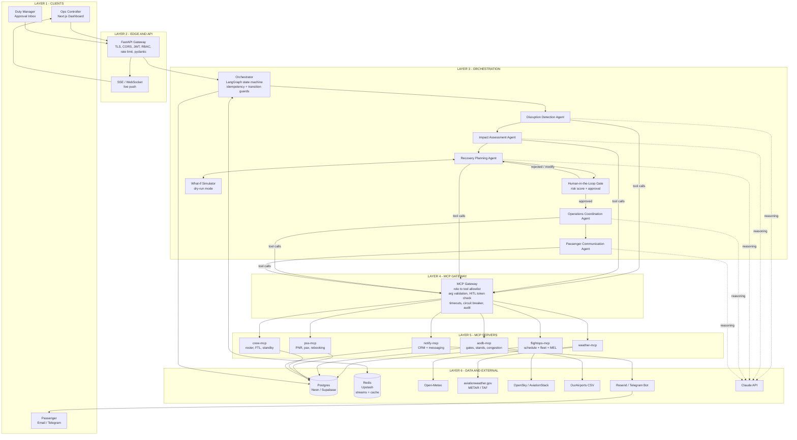
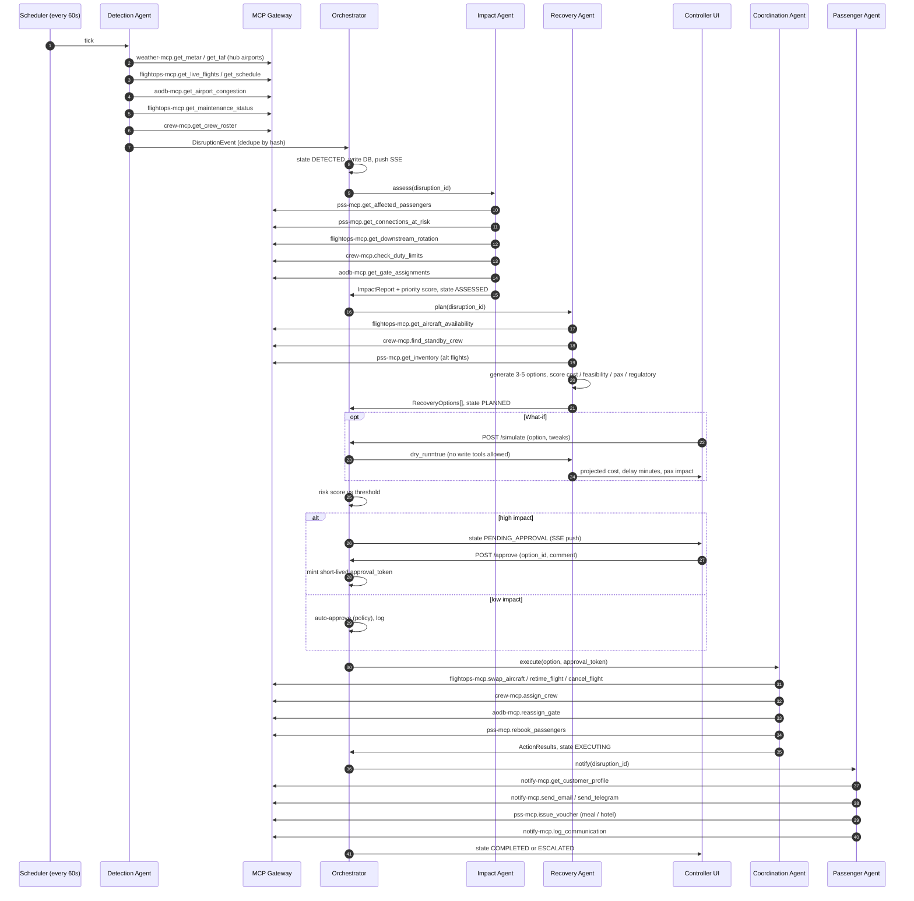
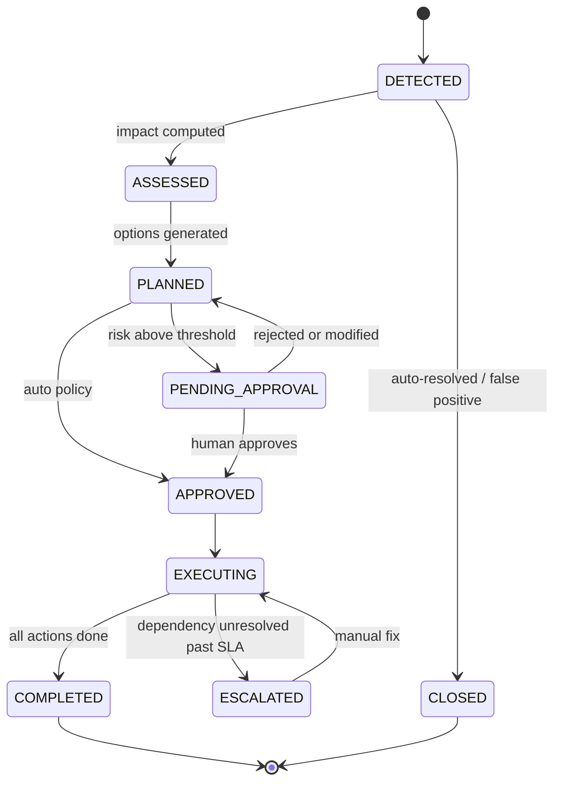
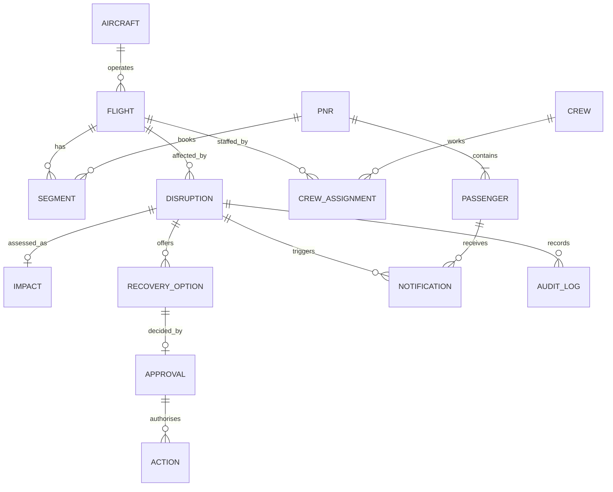

# Disruption Management & Recovery Orchestrator — Architecture & Build Plan

Multi-agent system (5 agents) + MCP gateway + 6 MCP servers, free APIs only, 4-person / 1-day build.

---

## 1. Design principles

| Principle | How we apply it |
| --- | --- |
| Agents never touch systems directly | Every system access goes through the **MCP Gateway** (role scope, validation, audit) |
| Read freely, write carefully | Tools are tagged `R` (read), `W-auto` (low-impact write), `W-HITL` (needs human approval token) |
| Deterministic skeleton, LLM brain | Orchestrator is a state machine; Claude only reasons *inside* each agent step with schema-validated JSON output |
| Everything is replayable | Every event, tool call, decision and approval is written to `audit_log` |
| Demo-safe | Real free feeds (weather, flights) + seeded mock PSS/crew/AODB + a `demo/inject` endpoint to trigger scenarios on demand |

---

## 2. System architecture (paste into mermaid.live or any Mermaid renderer)



---

## 3. End-to-end sequence (who calls what, when)



---

## 4. Disruption state machine



---

## 5. Tech stack

| Layer | Choice | Why / free tier |
| --- | --- | --- |
| Frontend | Next.js + Tailwind + Recharts + Leaflet | Fast to build; map + live tables |
| Realtime | SSE (`/api/v1/stream`) | Simpler than WebSocket for 1-way push |
| Backend | Python FastAPI | Async, pydantic validation, auto OpenAPI docs |
| Orchestration | LangGraph (or Claude Agent SDK) | Explicit graph = deterministic flow + HITL interrupt |
| MCP servers | `FastMCP` (Python MCP SDK), streamable HTTP | One file per server |
| LLM | Claude API (Sonnet for agents, Haiku for comms drafts) | Structured JSON output via tool-use schema |
| DB | Postgres (Neon or Supabase free) | Relational model fits flights / PNR |
| Cache / events | Redis (Upstash free) | Streams for event bus, cache API responses |
| Auth | Supabase Auth or simple JWT (roles: `controller`, `approver`, `admin`) | RBAC at API + MCP gateway |
| Deploy | Docker Compose locally; Render / Fly.io + Vercel for demo | Free tiers |

---

## 6. Free APIs and keys

Free-tier limits change, so verify on each provider's site before relying on a number.

| Purpose | API | Key needed? | Env var | Used by |
| --- | --- | --- | --- | --- |
| Airport weather (METAR/TAF) | aviationweather.gov Data API | No | — | `weather-mcp` |
| Forecast, wind, visibility, precipitation | Open-Meteo | No | — | `weather-mcp` |
| US severe weather alerts (optional) | api.weather.gov (NWS) | No (User-Agent header) | `NWS_UA` | `weather-mcp` |
| Live aircraft positions | OpenSky Network | Optional (account for higher limits) | `OPENSKY_CLIENT_ID`, `OPENSKY_CLIENT_SECRET` | `flightops-mcp` |
| Schedules, delays, status | AviationStack (small free quota) | Yes | `AVIATIONSTACK_KEY` | `flightops-mcp` |
| Airport master data (IATA, lat/lon, runways) | OurAirports CSV | No | — | `aodb-mcp` |
| Email | Resend (free daily quota) | Yes | `RESEND_API_KEY` | `notify-mcp` |
| Chat / push to demo "passengers" | Telegram Bot API | Yes (bot token from @BotFather) | `TELEGRAM_BOT_TOKEN` | `notify-mcp` |
| LLM | Anthropic API | Yes | `ANTHROPIC_API_KEY` | all agents |
| DB / cache | Neon or Supabase, Upstash | Yes | `DATABASE_URL`, `REDIS_URL` | backend |

**Reality check:** no free API exposes PSS, crew rosters, AODB gate data or MEL. Those four (`pss`, `crew`, `aodb` gates, maintenance) are **seeded mock services** backed by Postgres (generate \~50 flights, \~150 PNRs per flight with Faker). The MCP interface is identical to what a real PSS/AODB integration would expose, so the architecture stays honest. Real feeds drive weather and flight status; weather can also be overridden by `demo/inject`.

---

## 7. MCP servers and tools

Legend: `R` read, `A` write auto-allowed, `H` write requires approval token.

### 7.1 weather-mcp

| Tool | Type | Input | Output |
| --- | --- | --- | --- |
| `get_metar` | R | `icao` | raw + parsed wind, vis, ceiling, wx |
| `get_taf` | R | `icao`, `hours` | forecast periods |
| `get_forecast` | R | `lat`, `lon`, `hours` | hourly precip, gusts, visibility |
| `assess_weather_risk` | R | `icao`, `window` | risk level 0-100 + reasons (rule-based thresholds) |

### 7.2 flightops-mcp (schedule, fleet, maintenance)

| Tool | Type | Purpose |
| --- | --- | --- |
| `get_schedule` | R | Flights by date / airport / tail |
| `get_live_flights` | R | OpenSky / AviationStack status |
| `get_fleet_status` | R | Tails, location, type, seats |
| `get_maintenance_status` | R | Open defects, MEL items, AOG flag |
| `get_aircraft_availability` | R | Spare / idle tails in time window |
| `get_downstream_rotation` | R | Next legs of the same tail (knock-on) |
| `retime_flight` | H | Change STD/STA |
| `swap_aircraft` | H | Assign alternate tail |
| `cancel_flight` | H | Cancel + release resources |
| `add_extra_flight` | H | Recovery flight |

### 7.3 aodb-mcp (airport ops)

| Tool | Type | Purpose |
| --- | --- | --- |
| `get_airport_info` | R | OurAirports data |
| `get_gate_assignments` | R | Gates / stands by time |
| `get_airport_congestion` | R | Movements per hour vs capacity, queue |
| `get_curfew_slot_info` | R | Curfew, slot constraints |
| `reassign_gate` | A | Move flight to free gate |

### 7.4 pss-mcp (passenger system)

| Tool | Type | Purpose |
| --- | --- | --- |
| `get_affected_passengers` | R | PNRs on flight(s) with tier, fare class, special needs |
| `get_connections_at_risk` | R | Pax whose MCT is broken by new times |
| `get_inventory` | R | Seats left on alternate flights |
| `rebook_passengers` | H | Move PNR list to flight(s) |
| `issue_refund` | H | Refund / credit |
| `issue_voucher` | A | Meal / hotel voucher (capped amount) |

### 7.5 crew-mcp

| Tool | Type | Purpose |
| --- | --- | --- |
| `get_crew_roster` | R | Crew on flights / duty status |
| `check_duty_limits` | R | FTL check: duty hours, rest, max flight time (configurable rules, EASA/DGCA-style) |
| `find_standby_crew` | R | Standby / reserve with qualifications |
| `assign_crew` | H | Assign / swap crew |
| `notify_crew` | A | Crew call-out message |

### 7.6 notify-mcp (CRM + messaging)

| Tool | Type | Purpose |
| --- | --- | --- |
| `get_customer_profile` | R | Name, language, channel, tier, consent |
| `send_email` | A | Resend |
| `send_telegram` | A | Bot message |
| `send_sms` | A | Mock logger (no free SMS) |
| `log_communication` | A | Write to CRM log |

---

## 8. Agent responsibilities

| Agent | Trigger | Tools used | Output (strict JSON) | Key checks |
| --- | --- | --- | --- | --- |
| Detection | Scheduler 60s, `/internal/ingest/events`, `demo/inject` | weather `get_metar`, `get_taf`, `assess_weather_risk`; flightops `get_live_flights`, `get_schedule`, `get_maintenance_status`; aodb `get_airport_congestion`; crew `get_crew_roster` | `DisruptionEvent {type, flights[], severity, confidence, eta_minutes, evidence[]}` | Dedupe hash; confidence >= 0.6; predictive alerts flagged `potential` |
| Impact | `DETECTED` event | pss `get_affected_passengers`, `get_connections_at_risk`; flightops `get_downstream_rotation`; crew `check_duty_limits`; aodb `get_gate_assignments` | `ImpactReport {pax_count, vip_count, missed_connections, knock_on_flights, crew_legal_breach, gate_conflicts, priority_score}` | Priority score formula below; all counts reconcile with DB |
| Recovery | `ASSESSED` | flightops `get_aircraft_availability`; crew `find_standby_crew`; pss `get_inventory` | `RecoveryOption[] {id, actions[], cost, delay_min, pax_impacted, feasibility, regulatory_ok, score}` | Hard constraints first (FTL, curfew, aircraft range/seats); then rank |
| Coordination | `APPROVED` + token | flightops `swap_aircraft`, `retime_flight`, `cancel_flight`; crew `assign_crew`, `notify_crew`; aodb `reassign_gate`; pss `rebook_passengers` | `ActionResult[] {team, action, status, dependency}` | Token valid and bound to option_id; idempotent per action; SLA timer, escalate if blocked |
| Passenger Comms | Actions executing / done | notify `get_customer_profile`, `send_email`, `send_telegram`, `log_communication`; pss `issue_voucher`, `issue_refund` | `Notification[] {pax_id, channel, text, offer}` | Consent; language; no duplicate in 30 min; tier-aware offer; entitlement rules (delay > 3h meal, overnight hotel) |

**Priority score (Impact Agent):** `priority = 0.35*norm(pax) + 0.20*norm(missed_connections) + 0.15*vip_ratio + 0.15*knock_on_flights + 0.10*crew_breach + 0.05*(1 - minutes_to_departure/360)`

**Option score (Recovery Agent):** `score = 0.30*(1-norm(cost)) + 0.30*(1-norm(pax_impacted)) + 0.20*feasibility + 0.10*(1-norm(delay_min)) + 0.10*crew_legal` — any option with `regulatory_ok=false` is discarded, never ranked.

**HITL rule (Orchestrator):** require approval if any of: cancels a flight, `pax_impacted > 100`, `cost > $20k` (configurable), crew legality override, or any `H` tool involved. Otherwise auto-approve and log.

---

## 9. REST API routes

Base: `/api/v1`. All routes require `Authorization: Bearer <JWT>` except `/health` and `/auth/login`.

| Method | Route | Role | Purpose |
| --- | --- | --- | --- |
| POST | `/auth/login` | public | Returns JWT (role claim) |
| GET | `/health` | public | Liveness + MCP server ping |
| GET | `/stream` | any | SSE: `disruption.created`, `.updated`, `approval.requested`, `action.updated`, `notification.sent` |
| GET | `/dashboard/summary` | any | KPIs: active disruptions, pax affected, cost exposure, OTP |
| GET | `/flights` | any | Filter by date, airport, status |
| GET | `/flights/{id}` | any | Flight + tail + crew + gate |
| GET | `/weather/{icao}` | any | Cached METAR/TAF + risk |
| GET | `/disruptions` | any | `?status=&severity=&airport=` |
| GET | `/disruptions/{id}` | any | Full record + timeline |
| GET | `/disruptions/{id}/impact` | any | ImpactReport |
| GET | `/disruptions/{id}/options` | any | RecoveryOptions |
| POST | `/disruptions/{id}/simulate` | controller+ | What-if: body `{option_id, overrides}`, dry-run only |
| GET | `/approvals/pending` | approver | Queue |
| POST | `/disruptions/{id}/approve` | approver | `{option_id, comment}`, mints token |
| POST | `/disruptions/{id}/reject` | approver | `{reason, request_replan}` |
| GET | `/disruptions/{id}/execution` | any | Action list + status per team |
| POST | `/disruptions/{id}/escalate` | controller+ | Manual escalate |
| GET | `/disruptions/{id}/passengers` | controller+ | Affected pax + rebooking status |
| GET | `/notifications` | controller+ | `?disruption_id=` |
| POST | `/notifications/{id}/send` | controller+ | Approve / resend a drafted message |
| GET | `/audit` | admin | Tool-call and decision log |
| POST | `/demo/inject` | admin | `{scenario: "fog_delhi" \| "aog_tail" \| "crew_timeout" \| "congestion"}` |
| POST | `/internal/ingest/events` | service key | Webhook for external alerts |
| POST | `/internal/agents/run` | service key | Manually run an agent step |

---

## 10. Layer-by-layer checks (request path, user to server)

| # | Layer | Check |
| --- | --- | --- |
| 1 | Browser | Role-based UI hiding; CSRF-safe (Bearer header, no cookie auth) |
| 2 | Edge | HTTPS only, CORS allowlist, rate limit (e.g. 60 req/min/user via Redis) |
| 3 | API auth | JWT signature, expiry, role claim; reject otherwise 401/403 |
| 4 | API validation | Pydantic schemas; enum and range checks; reject unknown fields |
| 5 | Orchestrator | Idempotency key per event/action; state-transition guard (e.g. cannot EXECUTE before APPROVED); optimistic lock on disruption row |
| 6 | Agent | Claude output must parse into the Pydantic schema; retry once with error message; else mark `NEEDS_HUMAN` |
| 7 | Guardrails | Hard constraints coded in Python (FTL, curfew, seats), never left to the LLM |
| 8 | MCP Gateway | Agent role to tool allowlist; arg schema validation; `H` tools need valid `approval_token` (HMAC, TTL 15 min, bound to option_id); dry-run flag blocks all `A`/`H` writes; 10s timeout; circuit breaker; log every call |
| 9 | MCP server | Re-validate args; DB transaction; row-level checks (seat count, tail conflicts) |
| 10 | Data | FK constraints; append-only `audit_log`; PII masked in logs |
| 11 | Comms | Consent flag; dedupe; template + LLM personalization; no sensitive data in message body |
| 12 | Observability | Trace id across API, agent, gateway, server; dashboard "agent activity" panel |

**Agent-to-tool permission matrix**

| Agent | weather | flightops | aodb | pss | crew | notify |
| --- | --- | --- | --- | --- | --- | --- |
| Detection | R | R | R | – | R | – |
| Impact | R | R | R | R | R | – |
| Recovery | R | R | R | R | R | – |
| Coordination | – | R + H | R + A | R + H | R + H + A | – |
| Passenger | – | R | – | R + A + H(refund) | – | R + A |

---

## 11. Data model (core tables)



Tables: `airports, aircraft, flights, gates, crew, crew_assignments, pnrs, passengers, segments, disruptions, impacts, recovery_options, approvals, actions, notifications, audit_log`.

---

## 12. Demo scenarios (seed these)

| Scenario | Trigger | Expected agent behavior |
| --- | --- | --- |
| Fog at DEL | METAR vis \< 400 m (or injected) | Predict delays 2h ahead, retime, protect connections |
| AOG on tail | MEL item flips to AOG | Swap to spare tail; seat shortfall, rebook overflow |
| Crew timeout | FTL breach on late inbound | Standby crew or retime; HITL if override |
| Hub congestion | Movements > capacity | Gate reassign + sequence retime |

---

## 13. One-day plan for 4 people

| Person | Owns | Hours 0-2 | 2-5 | 5-8 | 8-10 |
| --- | --- | --- | --- | --- | --- |
| **A - Platform / Backend** | FastAPI, DB schema, auth, SSE, audit, routes | Schema + seed data + auth | All REST routes | Orchestrator state machine + HITL tokens | Hardening, deploy |
| **B - Agents / AI** | 5 agents, prompts, JSON schemas, scoring | Prompts + schemas | Detection + Impact | Recovery + Coordination + Comms | Eval on 4 scenarios |
| **C - MCP / Integrations** | 6 MCP servers + gateway | weather-mcp + gateway skeleton | flightops, aodb | pss, crew, notify | Permission matrix tests |
| **D - Frontend / Demo** | Dashboard, approval inbox, simulator UI, demo script | Layout + auth | Live table + map + SSE | Impact / options / approve / what-if | Demo rehearsal, slides, README |

**Sync points:** hour 2 (contracts frozen: JSON schemas + OpenAPI), hour 5 (first end-to-end on one scenario), hour 8 (feature freeze).

**Repo layout**

```
/apps/web                 # Next.js
/services/api             # FastAPI + orchestrator
/services/agents          # agent prompts, schemas, graph
/services/mcp/gateway
/services/mcp/{weather,flightops,aodb,pss,crew,notify}
/db/schema.sql  /db/seed.py
/docs/architecture.md
docker-compose.yml  .env.example
```

---

## 14. Risks and shortcuts

| Risk | Mitigation |
| --- | --- |
| Free flight API quota runs out | Cache 60s in Redis; fall back to seeded schedule |
| LLM returns bad JSON | Schema validation + one retry + `NEEDS_HUMAN` |
| Scope creep | Build one scenario end-to-end first, then add the rest |
| Live demo flakiness | `demo/inject` + pre-recorded fallback |